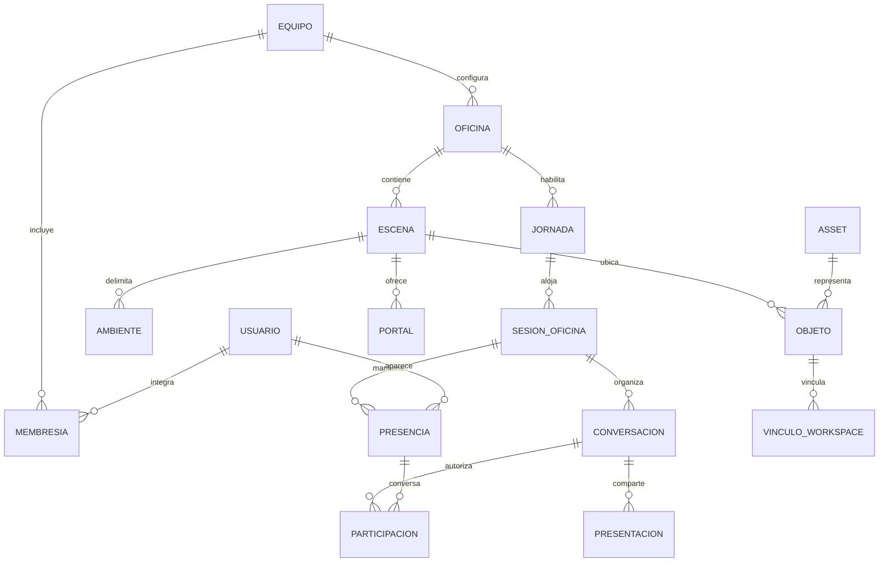

# 02 — Dominio y reglas de negocio

**Versión:** 1.0 · **Fecha:** 2026-09-30. Las reglas RB son normativas para esta base; las identificadas como propuestas derivan de ingeniería.

## 1. Lenguaje del dominio

| Término | Definición |
|---|---|
| Equipo | Organización de usuarios con membresías, políticas y recursos propios. |
| Oficina | Configuración persistente del espacio del equipo. No depende de un host navegador. |
| Escena | Sector lógico del mapa, visible como una pantalla y conectado mediante portales. |
| Ambiente | Área funcional/comunicacional. Puede ocupar toda una escena o parte de ella. |
| Portal | Salida espacial que conecta una escena con un punto de entrada de otra. |
| Puerta | Objeto con estado abierto/cerrado que puede habilitar un portal o dividir ambientes. |
| Objeto | Instancia de un asset, con propiedades gráficas, físicas e interactivas independientes. |
| Jornada | Ventana temporal concreta de acceso, calculada desde un horario y una zona horaria. |
| Sesión de oficina | Presencia temporal de usuarios y estado compartido mientras trabajan. |
| Presencia | Avatar de un usuario conectado a una sesión; reconexión y múltiples pestañas no deben duplicarlo. |
| Contexto de conversación | Audiencia A/V autorizada por proximidad, ambiente, grupo o reunión. |
| Sala multimedia | Recurso técnico SFU; no es necesariamente una escena ni la oficina completa. |
| Presentación | Flujo temporal de pantalla asociado a una superficie y una audiencia. |
| Vínculo Workspace | Asociación persistente entre un objeto/ambiente y un archivo externo; no cambia sus permisos por sí sola. |
| Asset | Recurso reutilizable de arte con medidas y metadatos de producción. |
| Derecho de uso | Habilitación futura de un asset o capacidad para un equipo/usuario; separada de poseer sus bytes. |

## 2. Modelo conceptual

Un portal referencia también su escena destino. El diagrama es conceptual, no un esquema de tablas definitivo. La primera entrega propone una oficina por equipo; la relación permite ampliarlo sin cambiar identidad.

## 3. Entidades y campos principales

| Entidad | Campos mínimos de referencia | Persistencia |
|---|---|---|
| Usuario | id opaco, identidad externa, nombre visible, avatarId, preferencias | Sí |
| Membresía | equipoId, usuarioId, rol, estado, permisos delegados | Sí |
| Oficina | id, equipoId, nombre, configuración, mapVersion | Sí |
| Escena | id, oficinaId, ancho/alto lógicos, spawn, versión | Sí |
| Ambiente | id, escenaId, área, acceso, modo A/V predeterminado | Sí |
| Objeto | id, escenaId, assetId, posición, orientación, collider, occluder, interacción | Sí; estados temporales separados |
| Horario | oficinaId, zona IANA, días, apertura/cierre, políticas | Sí |
| Jornada | id, oficinaId, aperturaUTC, cierreBaseUTC, cierreEfectivoUTC, políticaVacío, revision | Sí, con retención operativa por definir |
| Sesión | id, jornadaId, epoch, estado, inicio/fin | Metadatos de coordinación; contenido efímero |
| Presencia | usuarioId, sesiónId, escenaId, posición, orientación, conexión, lastSeen | Efímera |
| Conversación | id, tipo, contexto, miembros autorizados, estado | Efímera; política del ambiente persistente |
| Presentación | id, autor, superficie, contexto, trackId, estado | Efímera |
| GoogleConnection | usuario, identidad externa, scopes, estado | Sí; credenciales protegidas |
| VínculoWorkspace | objeto/ambiente, proveedor, fileId, título, tipo | Sí; sin copiar contenido por defecto |
| Partida | id, juego, participantes, estado, revisión | Efímera en alcance inicial |
| Catálogo/DerechoUso | asset/plan, titular, origen, vigencia | Evolución; persistente |

## 4. Roles y permisos propuestos

Los roles son conjuntos de capacidades comprobadas por el backend. Las preferencias del navegador no otorgan permisos.

| Capacidad | Administrador | Coordinador | Miembro | Invitado |
|---|---|---|---|---|
| Ingresar a ambientes autorizados | Sí | Sí | Sí | Sólo habilitados |
| Controlar cámara/micrófono propios | Sí | Sí | Sí | Si habilitado |
| Crear grupos | Sí | Sí | Si política permite | Si delegado |
| Presentar pantalla | Sí | Sí | Si habilitado | Si delegado |
| Configurar modo de ambiente | Sí | Si delegado | Si delegado | No por defecto |
| Solicitar prórroga | Sí | Sí | Sí, propuesta | Si habilitado |
| Aprobar prórroga | Sí | Si delegado | Si delegado | No por defecto |
| Seleccionar política de vacío | Sí | Si delegado | No por defecto | No |
| Cerrar/reabrir oficina | Sí | Si delegado | No por defecto | No |
| Gestionar miembros y roles | Sí | No por defecto | No | No |
| Cambiar horario/configuración | Sí | Si delegado | No | No |
| Personalizar mapa futuro | Sí | Si delegado | Si delegado | No |

No retirar o degradar al último administrador sin transferir esa capacidad. Una invitación no equivale a compartir archivos de Google. Acceso a una escena y permiso para publicar vídeo se validan por separado.

## 5. Reglas de negocio

| ID | Regla |
|---|---|
| RB-001 | La salida del primer participante o de un administrador no termina la sesión de los demás. |
| RB-002 | El servidor decide acceso y cierre usando la jornada efectiva, nunca el reloj del cliente. |
| RB-003 | La oficina se habilita dentro del horario; 08:00–16:00 es un ejemplo, no un valor global obligatorio. |
| RB-004 | Cerrar una sesión vacía libera recursos efímeros; no borra oficina, cuenta, avatar, vínculos o derechos. |
| RB-005 | Si se selecciona KEEP_UNTIL_DEADLINE, una sesión vacía puede recrearse al volver dentro del horario. |
| RB-006 | Si se selecciona CLOSE_WHEN_EMPTY, quedar vacía bloquea el ingreso hasta reapertura autorizada o próxima jornada. |
| RB-007 | Sólo un usuario con capacidad puede cambiar política, cierre o prórroga; la elección es explícita y queda registrada. |
| RB-008 | Prórroga actualiza una única fecha de cierre y se difunde a todos. Peticiones duplicadas no suman tiempo dos veces. |
| RB-009 | Dos usuarios distintos constituyen una sesión colaborativa activa. Se propone admitir a uno en espera y permitir gestión individual. |
| RB-010 | Dos pestañas del mismo usuario no cuentan como dos participantes; se propone una conexión principal por oficina. |
| RB-011 | Quince presentes es el objetivo inicial de capacidad; 2–6 por ambiente no es una restricción universal. |
| RB-012 | La transparencia se calcula para el avatar local, afecta lo que lo oculta y mantiene colisiones y permisos. |
| RB-013 | Compartir pantalla conserva la cámara si estaba encendida; detener pantalla no altera el micrófono por inferencia. |
| RB-014 | Grupo privado requiere membresía explícita y aislamiento de medios; no basta silenciar otros vídeos en UI. |
| RB-015 | Workspace respeta tanto la autorización de la app como el permiso de cada usuario sobre el archivo. |
| RB-016 | Ninguna cámara, micrófono o captura de pantalla se activa sin una acción/consentimiento compatible con el navegador. |
| RB-017 | Objetos y escenas utilizan IDs estables y versiones; el cliente no altera distribución o derechos sin permiso. |
| RB-018 | La evolución comercial conserva compras/desbloqueos al cerrar; aún no hay reglas de precios o puntos. |
| RB-019 | Toda acción crítica de equipo se limita a su tenant; una URL o peer ID no sustituye autorización. |
| RB-020 | En una transición se conserva usuario/sesión y se recalculan escena, ambiente y audiencia. |

## 6. Estados independientes

### Jornada de acceso

`SCHEDULED` → `OPEN` → `CLOSED`. Cierre temprano marca motivo `MANUAL` o `EMPTY_POLICY`; horario marca `DEADLINE`. La extensión cambia `effectiveCloseAt`, no crea otra jornada. Reapertura autorizada dentro de ventana pasa de `CLOSED` a `OPEN`. Reapertura fuera de ventana requiere una excepción explícita, pendiente de producto.

### Sesión y presencia

`EMPTY` (cero) → `WAITING` (uno) → `COLLABORATIVE` (dos o más). La reducción de participantes recorre el camino inverso. Una pérdida de conexión puede reservar la presencia durante la gracia de reconexión propuesta en `05`, sin contarla como online confirmado. Una sesión en espera no enciende medios sin audiencia.

### Comunicación

`NONE`, `PROXIMITY`, `AMBIENT`, `GROUP`, `MEETING`. Base propuesta: un contexto A/V principal por usuario, evitando audio duplicado. Entrar a un grupo suspende el contexto automático; al salir se reevalúa el ambiente actual. La decisión se conserva como pendiente explícito en `07`.

## 7. Persistencia y consistencia

Persistir cambios de configuración, membresía y avatar antes de responder éxito. Usar revisión y control de concurrencia para horarios, prórrogas, roles y derechos futuros. Aplicar autorización desde la fuente central al ejecutar cada acción; no confiar en una caché eventual para conceder acceso.

Posiciones, indicadores de habla y presencia visual toleran sincronización eventual, interpolación y snapshots. No guardar cada movimiento en PostgreSQL. Las preferencias personales se guardan con respuesta de confirmación y pueden propagarse a otras pestañas después.

Contenido de documentos permanece en Google. No eliminar documentos al cerrar oficina. Chat y partidas se proponen efímeros en la primera versión; retención de chat/auditoría y consentimiento de grabación quedan pendientes, sin grabación por defecto. Las puertas recuperan su estado inicial de mapa en una sesión nueva como default propuesto; su posición y configuración sí persisten. La entrada de una jornada no restaura por inferencia las llamadas o partidas de la anterior.
