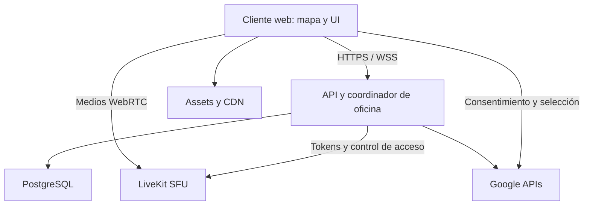

# 03 — Tecnologías y arquitectura de referencia

**Versión:** 1.0 · **Fecha:** 2026-09-30 · **Estado:** base técnica recomendada para implementar los requisitos acordados. No describe infraestructura ya contratada.

## 1. Decisión principal

Frontend web sin framework de UI pesado; motor propio sobre Canvas 2D; backend modular autoritativo; PostgreSQL para datos persistentes; WebSocket para estado del mundo; WebRTC mediante SFU para medios.

Se recomienda sustituir el modelo host/PeerJS de la pre-alpha por coordinación de servidor y LiveKit para A/V. Mantener PeerJS sólo en la rama de comparación durante la migración; no ejecutar simultáneamente ambas redes en producción. Esta sustitución permite que la oficina no dependa de quien entró primero y reduce las publicaciones duplicadas por destinatario en reuniones. La SFU no elimina el consumo de decodificar muchos vídeos: deben limitarse suscripciones/calidad.

## 2. Stack seleccionado como referencia

| Capa | Tecnología | Uso y motivo de elección |
|---|---|---|
| Lenguaje cliente/servidor | TypeScript estricto | Tipar mapas, contratos y estados; se compila a JavaScript. Es una propuesta sobre el JS de la pre-alpha. |
| UI | HTML semántico, CSS modular, DOM | Paneles, controles, documentos, accesibilidad y vistas de llamada. |
| Build frontend | Vite, plantilla vanilla-ts | Módulos, recursos versionados y carga diferida; sin React/Angular en esta base. |
| Mundo | Canvas 2D y requestAnimationFrame | Sprites, profundidad, oclusión y movimiento. |
| Entrada | Keyboard + Pointer Events | WASD/flechas, acción E y joystick analógico. |
| Medios | LiveKit JS SDK + WebRTC | Cámara, micrófono y pantalla como pistas independientes. |
| SFU inicial | LiveKit Cloud | Propuesta de proveedor inicial; requiere cuenta/coste y prueba de conectividad antes de contratar. |
| API y coordinación | Node.js LTS, Fastify | Identidad de app, equipos, horarios, permisos y comandos. |
| Estado en tiempo real | @fastify/websocket y WebSocket nativo | Presencia, puertas, portales, chat, juegos y control de sesión. |
| Validación | JSON Schema de Fastify | Validar tanto HTTP como mensajes WS y mapas. |
| Persistencia | PostgreSQL + pg + SQL versionado | Relaciones, transacciones, revisiones e idempotencia. |
| Arte y archivos propios | Almacenamiento compatible con S3 + CDN | Sprites/manifest; proveedor pendiente. No subir documentos Google aquí por defecto. |
| Identidad inicial | Google OpenID Connect | Propuesta de login inicial con Google; separado de autorizar Workspace. |
| Workspace | OAuth 2.0, Google Picker, Drive/Docs/Sheets APIs | Archivos seleccionados, contenido y operaciones limitadas autorizadas. |
| Verificación | Vitest, Playwright, pruebas de integración HTTP/WS | Motor, reglas críticas y recorridos reales. |
| Operación | Docker para API, logs estructurados, métricas | Entornos repetibles y diagnósticos sin registrar contenido de llamadas. |

Fijar versiones compatibles y lockfile al inicializar el repositorio, después de verificar soporte. No usar `latest` en una imagen productiva ni asumir que PeerJS 1.5.4 determina las versiones nuevas.

## 3. Componentes y flujo de datos



- **Frontend:** simula entrada para respuesta inmediata, dibuja, interpola estados remotos y muestra la audiencia activa.
- **Backend:** valida comandos, calcula posiciones autorizadas, programa cierre, emite snapshots y mantiene la verdad de permisos.
- **SFU:** transporta medios; su sala no sustituye reglas de negocio de la oficina.
- **Base:** guarda configuración, jornada, identidad y revisiones críticas; no recibe 15 escrituras por segundo por avatar.

## 4. Estructura propuesta del repositorio

```text
apps/web/src/
  app/             inicialización y ciclo de vida
  domain/          modelos puros
  engine/          input, movimiento, cámara, colisión, oclusión
  rendering/       capas, sprites y cachés
  realtime/        conexión WS, snapshots y reconciliación
  media/           LiveKit, audiencia y presentación
  workspace/       selección y paneles Google
  games/           snake y pong, cargados bajo demanda
  ui/              controles DOM y accesibilidad
  assets/          manifiestos y escenas
apps/api/src/
  modules/         auth, teams, offices, schedule, presence, media, workspace
  realtime/        validación y coordinación
  jobs/            cierre, prórrogas y reconciliación
  persistence/     consultas y migraciones
packages/contracts/ esquemas y eventos compartidos
tests/              integración, recorridos y rendimiento
```

No introducir microservicios, Kubernetes, Redis o motor WebGL en I1 sin necesidad medida. Primer despliegue propuesto: una instancia de coordinación, varias oficinas lógicas aisladas. Antes de escalar horizontalmente, incorporar propietario único por sesión, bus/pubsub y coordinación distribuida; las salas no pueden quedar repartidas sin una autoridad clara.

## 5. Estado autoritativo y protocolo

Un WebSocket autenticado por conexión principal de oficina. Mensajes con versión, tipo y contexto. Comandos críticos llevan requestId, expectedRevision y un ACK; movimientos usan secuencia, entrada normalizada y ACK de posición. El cliente no envía rol, saldo, permiso o estado global como verdad.

Simulación del servidor propuesta a 20 Hz cuando hay movimiento/partida; envío de entrada máximo 15 Hz y snapshots de escena hasta 10 Hz. Son parámetros iniciales, no valores medidos. Coalescer movimientos pendientes y snapshots; nunca perder un ACK de cierre o extensión. Aplicar backpressure y desconectar clientes que exceden límites sin acumular memoria ilimitada.

Separar mensajes de mundo del transporte multimedia. Los controles de cierre no dependen de una pista de datos ligada a la llamada. Reconciliar el render local con los ACK; descartar eventos de otra sesión/epoch o versión de mapa.

## 6. Salas A/V y privacidad

Base propuesta: salas SFU de ámbito público por escena/ambiente, salas separadas para grupos privados y sala de reunión para daily. Un contexto principal por usuario; al cambiar, coordinar la salida/entrada sin cortar su presencia en el mundo. Publicar cámara/micrófono una vez por contexto activo.

En espacios públicos, proximidad controla las suscripciones y el volumen. **El radio de proximidad no se anuncia como una barrera de privacidad frente a un cliente modificado.** Las conversaciones confidenciales usan contextos privados separados, con tokens para sus miembros. No conceder acceso global a la oficina multimedia para después esconder vídeos en CSS.

LiveKit permite suscripción selectiva y adaptación según el tamaño/visibilidad de los elementos. Usar elementos HTML de vídeo vinculados a coordenadas para aprovechar esas funciones; evitar copiar todos sus fotogramas al Canvas. [S1]

Al expulsar, cambiar de ambiente protegido o cerrar: impedir nuevos tokens, retirar al participante y revocar permisos/tokens. La revocación de tokens difiere entre Cloud y self-hosted; el proveedor inicial Cloud se validará con el corte explícito de revocación documentado. Un TTL corto por sí solo no expulsa una conexión activa. [S2]

Si se exige privacidad estricta también por distancia, realizar SP-01 de `07` y adoptar aislamiento de contexto o ACL de pistas validada; no darla por resuelta mediante volumen local.

## 7. Identidad y Workspace

Login de app mediante OIDC: validar issuer, audience, firma y estado del flujo; identificar por subject externo estable, no sólo email. Propuesta de sesión de app con cookie HttpOnly/Secure y protección CSRF/origin para acciones; evitar tokens de larga vida en localStorage. Los tokens de LiveKit son específicos y se emiten sólo tras comprobar membresía, horario y contexto.

Autorizar Workspace en un paso separado. Comenzar con archivos seleccionados y `drive.file`, recomendado por Google para acceso limitado por archivo. Guardar tokens necesarios cifrados en el servidor; permitir desconectar la integración. No pedir permisos generales de Drive si no son necesarios. [S3]

Picker selecciona archivos; las APIs operan sobre ellos. Implementar una vista interna y acciones delimitadas de Docs/Sheets con control de concurrencia cuando corresponda. El editor nativo completo incrustado es una prueba de viabilidad aparte; no publicar documentos privados en la web para conseguir un iframe. [S4]

## 8. Despliegue y recuperación

Se puede conservar Vercel para el frontend estático. El backend con WebSocket persistente necesita un servicio que lo soporte; no alojarlo como servidor WebSocket de una Vercel Function. La documentación de Vercel remite a proveedores de tiempo real para esa función. [S5]

Provider de API, región, almacenamiento, costes y plan de LiveKit: pendientes. Elegir región cercana al público objetivo y validar latencia. HTTPS/WSS obligatorios; credenciales exclusivamente en servidor. API y frontend usan orígenes permitidos.

Horarios/jornadas persistidas: un job y comprobaciones en cada join/acción reconstruyen el cierre tras reinicio. El cierre lógico en DB precede a la expulsión SFU; si ésta falla, reintentar y no volver a habilitar acceso. Reabrir API no restaura una llamada anterior: crear estado temporal nuevo con epoch diferente y notificar recuperación.

## 9. Migración desde la pre-alpha

Inventariar módulos y reutilizar funciones que pasen validación: entrada, sprites, colisiones y UI. Sustituir room=PEER_ID como mecanismo de autorización por oficina/sesión de servidor e invitaciones verificadas. Adoptar manifest de arte y mapas versionados. Migrar A/V después de demostrar cámara y pantalla independientes con 2 y 6 usuarios. Comparar consumo contra pre-alpha; retirar dependencias y handlers antiguos al completar la migración.

## Fuentes técnicas

- **S1:** https://docs.livekit.io/transport/media/subscribe/
- **S2:** https://docs.livekit.io/frontends/reference/tokens-grants/
- **S3:** https://developers.google.com/workspace/drive/api/guides/api-specific-auth
- **S4:** https://developers.google.com/workspace/drive/picker/guides/overview y https://developers.google.com/workspace/docs/api/how-tos/overview
- **S5:** https://vercel.com/kb/guide/do-vercel-serverless-functions-support-websocket-connections

Fuentes oficiales consultadas el 2026-09-30. Estas referencias sustentan capacidades de herramientas; la arquitectura de Pixel Office es una propuesta propia y requiere validación.
